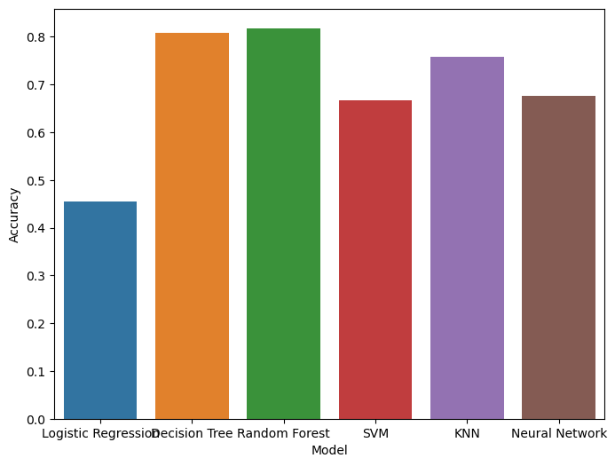

# Yapay Zeka - odev 2

Parsa Kazerooni - 19011915 @ YTU - Prof.Dr. Mehmet Fatih Amasyalı

Bu proje, YTU Yapay Zeka dersi için hazırlanmıştır.
Web Scraping ile Hollanda'nin en büyük supermarket'i olan [Albert Heijn](https://www.ah.nl/) üzerinden yemek urunleri ve beslenme detaylari veri olarak çekilmiştir. Sonra supervised learning  algoritmalari ile bu veriler üzerinden ne kadar saglikli bir yemek oldugunu siniflandirici modeller tasarlanmistir. Saglik olcumu, Fransa'dan kaynaklanan [Nutri-Score](https://en.wikipedia.org/wiki/Nutri-Score) yontemidir. Sonra bu modellerin performanslari karsilastirilmistir.

---

## Kurulum

requirements.txt dosyası içerisindeki kütüphanelerin kurulumu için:

```bash
pip install -r requirements.txt
```

## 1. Scraping

`scraping` klasörü içerisindeki `populate_urls.py` dosyası, farkli urun kategorilerinden urunlerin url'lerini cekmektedir. Bu url'ler daha sonra `populate_products.py` dosyasinda urunlerin detaylarini cekmek icin kullanilmaktadir. Bu dosyalarin cekmis oldugu veriler `data` klasorunde bulunmaktadir.

```bash
python scraping/populate_urls.py
python scraping/populate_products.py
```

## 2. Data

Automation islemi, DDoS saldirisi gibi algilanmamasi icin veriler daha kucuk parcalar ve araliklar halinde cekilmistir. Bu yuzden verilerin birlestirilmesi gerekmektedir. `data` klasorunde bulunan verileri birlestirmek icin `merge_data.py` dosyasi kullanilmaktadir. Bu dosya, verileri birlestirip `data/ah.csv` dosyasina kaydetmektedir.

```bash
python data/merge_csvs.py
```

Yaklasik 600 farkli urunun, 20 farkli beslenme ozelligi bulunmaktadir. Bu ozelliklerin bir kismi cok az sayida bulunmakta oldugu icin, sonradan analize dahil edilmemistir. Bu yuzden, 20 ozellikten 10 tanesi secilmistir.


## 3. Notebook

`notebook.ipynb` dosyasi, verilerin islenmesi ve algoritmalarin egitilmesi ve karsilastirilmasini icerir.

## 4. Sonuclar

6 tane farkli siniflandirici model, Logistic Regression, Decision Tree, Random Forest, KNN, SVM ve Neural Network, kullanilmistir. Bu modellerin performanslari karsilastirilmistir. Sonuclar asagidaki gibidir:



Daha iyi performans saglamak icin, Normalization ve feature selection uygulanmistir.

10-fold cross validation ile modellerin performanslari karsilastirilmistir. Her modelin score gecmisileri kaydedilmistir. ve ona gore t-testi yapilmistir. Sonuclar asagidaki gibidir:

```yaml
Logistic Regression vs Decision Tree: t=-10.98, p=0.00
Logistic Regression vs Random Forest: t=-11.64, p=0.00
Logistic Regression vs SVM: t=-6.20, p=0.00
Logistic Regression vs KNN: t=-8.82, p=0.00
Logistic Regression vs Neural Network: t=-6.35, p=0.00
Decision Tree vs Random Forest: t=-0.29, p=0.77
Decision Tree vs SVM: t=4.24, p=0.00
Decision Tree vs KNN: t=1.53, p=0.14
Decision Tree vs Neural Network: t=3.90, p=0.00
Random Forest vs SVM: t=4.65, p=0.00
Random Forest vs KNN: t=1.85, p=0.08
Random Forest vs Neural Network: t=4.28, p=0.00
SVM vs KNN: t=-2.55, p=0.02
SVM vs Neural Network: t=-0.25, p=0.80
KNN vs Neural Network: t=2.26, p=0.04
```

## References

1. <https://www.ah.nl/>
2. <https://en.wikipedia.org/wiki/Nutri-Score>
3. <https://machinelearningmastery.com/k-fold-cross-validation/>
