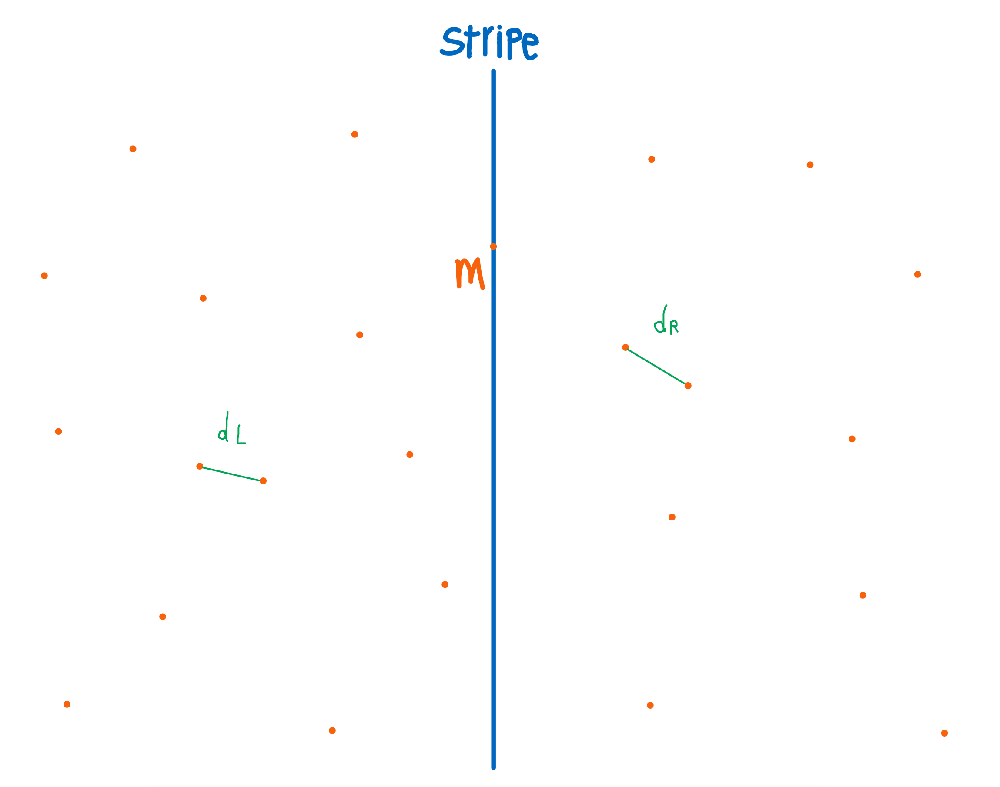
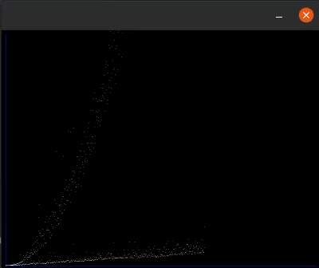

# **Closest Pair of Points**

Bu algorıtma, verilen bir nokta kümesindeki en yakın noktaların uzaklığı hesaplamaya çalışmaktadır.

---

- [**Closest Pair of Points**](#closest-pair-of-points)
  - [**Closest Pair Problem ( Divide and Conquer)**](#closest-pair-problem--divide-and-conquer)
  - [**Time Complexity**](#time-complexity)
    - [**Ispat**](#ispat)
  - [**Code**](#code)
  - [**Plotting**](#plotting)

---

* ## **Brute Force çözümü**

    O(n^2), 2 iç içe for ile tüm ikilileri kıyaslayarak minimum'u elde edebiliriz.

    ```c
    for (int i = 0; i < n; i++) // upper trig
        for (int j = i+1; j < n; j++){
            dist = distance(points[i], points[j]);
            if (dist < min_dist)
                min_dist = dist;
        }
    ```

* ## **Divide and Conquer**

    Bu teknik 3 adım ile gerçekleşebilir:
    1. **Divide** : Ana problemi alt problemlere bölünme işlemidir
    2. **Conquer** : alt problemleri recursive olarak çağrayıp çözmesidir .
    3. **Combine** : Çözülmüş alt problemleri birbirine birleştirerek ana programımize çevirmesidir.

---

## **Closest Pair Problem ( Divide and Conquer)**



Verilen n adet noktamız var.

`Divide` adımda noktaları iki gruba ayırırız,
X'e göre şort edip ortadaki nokta m olsun.
m'in soldaki noktalar L ve sağdakilar ise R olsun.
(adım için L ve R için tekrar yarıya bölme işlemi yapacağız.)\
\* nokta sayısı 3'ten küçük eşit ise, brüteforce algorıtması iyice çalışır, maximum 6 kıyaslama yapılır.

`Conquer` kısmında:

    dL = minimum distance L \
    dR =  minimum distance R \
    ==> d = min(dL, dR) olsun.

Ama hala d cevapımız olduğundan emin değiliz.
Üçüncü bir durum:\
split yaparken ( m'den geçen dikey çizgi ),
aradığımız noktalar, birisi sağda diğeri solda kalma ihtimali var.\
Eğer d'den küçük bir değer varsa, split çizgiye yakın olması gerekecek. ( maximum d uzaklığında )

split çizgiye yeterince yakın noktalar S olsun.
noktaları Y'ye göre şort edip, minimum distance'ı normal brüteforce ile :

    dS = minimum distance S

`Combine` adımda, min(d, dS)'yi return edeceğiz. ve problem çözülür.

---

## **Time Complexity**

Recursion ve yarıya bölme işimiz 2T(n/2) olacaktır.
dS'i bulmak için, iki for kullandığımıza rağmen, O(n) karmaşıklığı yeterlidir.\
Algoritmanın zaman karmaşıklığı:
> 2T(n/2) + O(n) = O(n*log(n))

### **Ispat**


Eğer bu şekilde, S etrafları boyutu d*d olan karelerele bölünür ise, her bir kare içinde maximum bir nokta olacaktır;
( eğer iki nokta var olduğunu varsayılalım, d farklı olacaktı).\
Bundan dolayı, işimiz daha kolay olur.
Her bir p S nokta için maximum 6 nokta karşındayız.
ve O(n) karmaşıklığinde dS'i hesaplayabiliriz.

---

## **Code**

Point structure'i:

```c
typedef struct Point{
    int x, y;
} Point;
```

gereken araç fonksiyonler:

```c
float distance(Point p1, Point p2){ // Eucledean Distance
    int dx = p2.x - p1.x;
    int dy = p2.y - p1.y;
    return sqrt(dx*dx + dy*dy);
}
```

```c
int compareX (const void * a, const void * b){ // qsort() by x
    Point *p1 = (Point *)a;
    Point *p2 = (Point *)b;
    return ( p1->x - p2->x );
}
int compareY (const void * a, const void * b){ // qsort() by y
    Point *p1 = (Point *)a;
    Point *p2 = (Point *)b;
    return ( p1->y - p2->y );
}
```

Brutefoce algoritması:

```c
float bruteforce(Point points[], int n){
    float dist, min_dist = FLT_MAX; //  FLT_MAX ~ infinity
    for (int i = 0; i < n; i++)
        for (int j = i+1; j < n; j++){
            dist = distance(points[i], points[j]);
            if (dist < min_dist)
                min_dist = dist;
        }
    return min_dist;
}
```

Algoritma:

```c
float closestPair(Point points[], int n) {
    qsort(points, n, sizeof(Point), compareX);
    return closestPair_DC(points, n);
}
```

```c
float closestPair_DC(Point points[], int n) {
    // Base of recursion; maximum 6 steps ( O(1) )
    // for n=2 n=3 it's just better to bruteforce
    if (n <= 3)
        return bruteforce(points, n);

    // middle point
    int mid = n/2;
    Point pmid = points[mid];

    // Find dl and dr
    float dl = closestPair_DC(points, mid); // min distance of left side
    float dr = closestPair_DC(points + mid, n-mid);  // ~ of right side
  
    float d = min(dl, dr); // best of dl and dr
  
    // Build strip[] for points near the dividor (closer than d)  
    Point strip[n];
    int n_stripe = 0;
    for (int i = 0; i < n; i++)
        if (abs(points[i].x - pmid.x) < d)
            strip[n_stripe++] = points[i];
  
    // Find the closest points in strip.  Return the minimum of d and closest
    // distance is strip[]

    return min(d, ClosestPair_stripe(strip, n_stripe, d) );
}
```

```c
float ClosestPair_stripe(Point strip[], int n, float d) {
    // minimum distance of the points in a d sized stripe
    qsort(strip, n, sizeof(Point), compareY);
    float min = d;
    for (int i = 0; i < n; ++i)
        for (int j = i+1; j < n && (strip[j].y - strip[i].y) < min; ++j)
            if (distance(strip[i],strip[j]) < min)
                min = distance(strip[i], strip[j]);
    return min;
}
```

Ve grafik tasarımı için SDL kullanılmaktadır.

## **Plotting**

BrüteForce ve Divide and Conquer algoritmalar, farklı input sayılarla çalıştırıp, çalışma zamanını hesapladikten sonra bir data[]'ya koyarız ve grafiğini ekrana gösteririz.



---
Links:
* [Youtube](https://youtu.be/Cz8f8MacyXs)
* [Github](https://github.com/parsakzr/YTU)