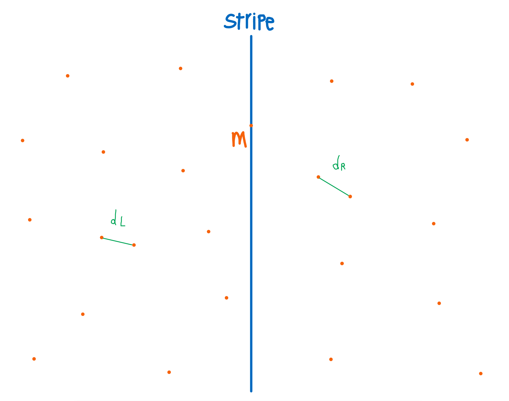
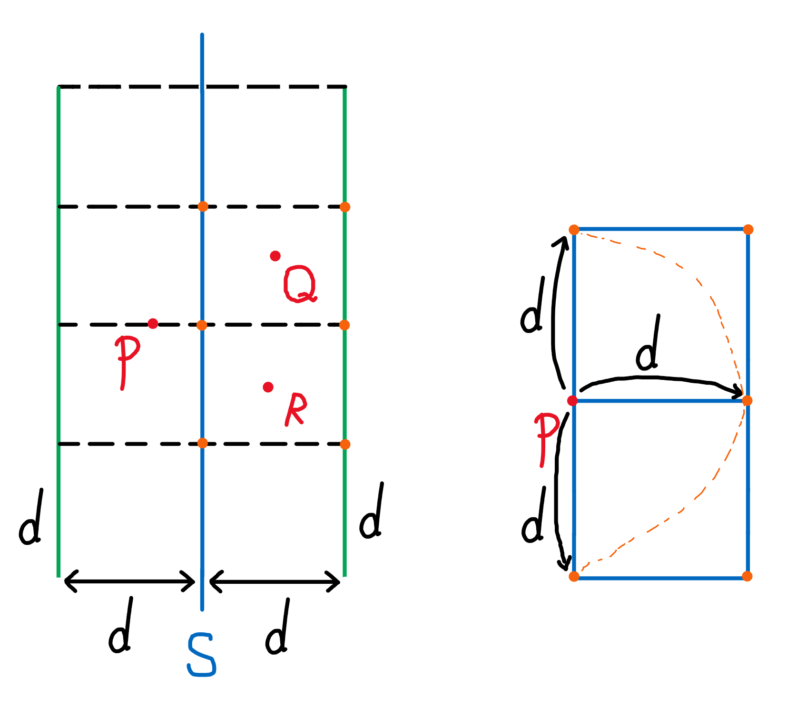

# **Closest Pair of Points**

Bu algorıtma, verilen bir nokta kümesindeki en yakın noktaları ve uzaklığıni hesaplamaya çalışmaktadır.

---
## İçerik Tablosu
- [**Yöntem**](#Yöntem)
  - [**Closest Pair Problem ( Divide and Conquer)**](#closest-pair-problem--divide-and-conquer)
  - [**Time Complexity**](#time-complexity)
    - [**İspat**](#İspat)
- [**Uygulama**](#Uygulama)

---

* ## **Brute Force çözümü**

    O(n^2), 2 iç içe for ile tüm ikilileri kıyaslayarak minimum'u elde edebiliriz.

    ```c
    for (int i = 0; i < n; i++) // upper trig
        for (int j = i+1; j < n; j++){
            dist = distance(points[i], points[j]);
            if (dist < min_dist)
                min_dist = dist;
        }
    ```

---

## Yöntem

### **Closest Pair Problem ( Divide and Conquer)**



Verilen n adet noktamız var.

`Divide` adımda noktaları iki gruba ayırırız,
X'e göre şort edip ortadaki nokta m olsun.
m'in soldaki noktalar L ve sağdakilar ise R olsun.
(adım için L ve R için tekrar yarıya bölme işlemi yapacağız.)\
\* nokta sayısı 3'ten küçük eşit ise, bruteforce algorıtması iyice çalışır, maximum 6 kıyaslama yapılır.

`Conquer` kısmında:

    dL = minimum distance L \
    dR =  minimum distance R \
    ==> d = min(dL, dR) olsun.

Ama hala d cevapımız olduğundan emin değiliz.
Üçüncü bir durum:\
split yaparken ( m'den geçen dikey çizgi ),
aradığımız noktalar, birisi sağda diğeri solda kalma ihtimali var.\
Eğer d'den küçük bir değer varsa, split çizgiye yakın olması gerekecek. ( maximum d uzaklığında )

split çizgiye yeterince yakın noktalar S olsun.
noktaları Y'ye göre şort edip, minimum distance'ı normal brüteforce ile :

    dS = minimum distance S

`Combine` adımda, min(d, dS)'yi return edeceğiz. ve problem çözülür.

---

## **Time Complexity**

Recursion ve yarıya bölme işimiz 2T(n/2) olacaktır.
dS'i bulmak için, iki for kullandığımıza rağmen, O(n) karmaşıklığı yeterlidir. (İspat)\
Algoritmanın zaman karmaşıklığı:

`2T(n/2) + O(n) = O(n*log(n))`

### **İspat**



Eğer bu şekilde, S etrafları boyutu d*d olan karelerele bölünür ise, her bir kare içinde maximum bir nokta olacaktır;
( eğer iki nokta var olduğunu varsayılalım, d farklı olacaktı).\
Bundan dolayı, işimiz daha kolay olur.
Her bir p S nokta için maximum 6 nokta karşındayız.
ve O(n) karmaşıklığinde dS'i hesaplayabiliriz.

---

## **Uygulama**

### Point structure'i:

```c
typedef struct Point{
    int x, y; kartezyen koordinatlari
} Point;
```

### Gereken araç fonksiyonler:


```c
float distance_sq(Point p1, Point p2){ // Eucledean Distance
    int dx = p2.x - p1.x;
    int dy = p2.y - p1.y;
    return dx*dx + dy*dy;
}
```

```c
int compareX (const void * a, const void * b){ // qsort() by x
    Point *p1 = (Point *)a;
    Point *p2 = (Point *)b;
    return ( p1->x - p2->x );
}
int compareY (const void * a, const void * b){ // qsort() by y
    Point *p1 = (Point *)a;
    Point *p2 = (Point *)b;
    return ( p1->y - p2->y );
}
```

### Brutefoce :

```c
float bruteforce(Point *points, int n, Point *p1, Point *p2){
    float dist;
    float min_dist = distance_sq(points[0], points[1]);
    p1 = &points[0];
    p2 = &points[1];

    for (int i = 0; i < n; i++)
        for (int j = i+1; j < n; j++){
            dist = distance_sq(points[i], points[j]);
            if (dist < min_dist){
                min_dist = dist;
                p1 = &points[i];
                p2 = &points[j];
            }  
        }

    return min_dist;
}

```

### Closest Pair (D&C) Algoritması:

```c
float closestPair(Point points[], int n, Point *p1, Point *p2) {
    //find the closest pair in a set of points

     // Sort the points relative to x
    qsort(points, n, sizeof(Point), compareX);

    // Main Algorithm, Divide and Conquer

    // Base of recursion; maximum 6 steps ( O(1) )
    // for n=2 or n=3 bruteforce is needed
    if (n <= 3) 
        return bruteforce(points, n, p1, p2); 
  
    // Median point 
    int mid = n/2; // the index
    Point pmid = points[mid]; // the middle point
    
    // Find dl and dr
    Point *pr1, *pr2; // to not overwrite the p1 p2 value on dr (second call)
    float dl = closestPair(points, mid, p1, p2); // min distance of left side
    float dr = closestPair(points+mid, n-mid, pr1, pr2);  // ~ of right side
  
    // d = min(dl, dr)
    float d = dl; // didn't use the min() function because of p1 and p2 
    if(dr<dl){
        d = dr;
        p1 = pr1;
        p2 = pr2;
    }
  
    // Build strip[] for points near the dividor (closer than d)  
    Point *stripe;
    stripe = (Point*) malloc (sizeof(Point) * n); // DList of n points
    if (points == NULL){
        fprintf(stderr, "[!] ERROR : Couldn't Allocate Memory!\n");
        exit(EXIT_FAILURE);
    }

    // Add the close points to the stripe list
    int n_stripe = 0; 
    for (int i = 0; i < n; i++) 
        if (abs(points[i].x - pmid.x) < d) 
            stripe[n_stripe++] = points[i]; 
  
    // Find the closest points in strip.
    Point *ps1, *ps2;
    float ds = ClosestPair_stripe(stripe, n_stripe, d, ps1, ps2);

    // result = minimum of d and ds, also handle p1, p2
    float dmin = d;
    if (ds<d){
        dmin = ds;
        p1 = ps1;
        p2 = ps2;
    }


    free(stripe); // memory management in a recursive call

    return dmin;
}
```

```c
float ClosestPair_stripe(Point *stripe, int n, float d, Point *p1, Point *p2) {
    // minimum distance of the points in a d sized stripe
    qsort(stripe, n, sizeof(Point), compareY); // sort by Y
    float min = d;
    for (int i = 0; i < n; ++i)
        for (int j = i+1; j < n && (stripe[j].y - stripe[i].y) < min; ++j)
            if (distance_sq(stripe[i],stripe[j]) < min){
                min = distance_sq(stripe[i], stripe[j]);
                p1 = &stripe[i];
                p2 = &stripe[j];
            }
    
    return min;
}
```

---
Links:
* [Referans](https://people.csail.mit.edu/indyk/6.838-old/handouts/lec17.pdf)
* [Çektiğim Youtube video'su](https://youtu.be/Cz8f8MacyXs)
* [Github](https://github.com/parsakzr/YTU-CE/tree/master/SEM5/AlgorithmAnalysis/Assignment1)